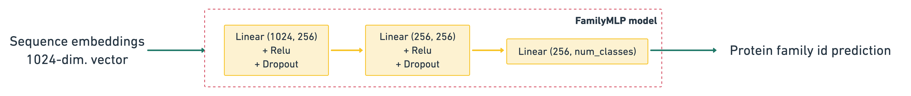

# Pfam32.0 classifier

## Description
This is a **DeepChain app** to predict the _protein family id_ out of a given sequence. :dna: :test_tube: :mag:

The app can be found in the [DeepChain App hub](https://app.deepchain.bio/hub/apps).

## Data
- This app has been trained with the `pfam32.0` dataset available with the [bio-datasets](https://pypi.org/project/bio-datasets) API:
```python
# Load pfam dataset
pfam_dataset = load_dataset("pfam-32.0", force=True)
_, y = pfam_dataset.to_npy_arrays(input_names=["sequence"], target_names=["family_id"])
```

- This dataset contains roughly 1339k protein sequences for which the following features are available:
  - `sequence` - raw sequence **feature**
  - `sequence_name` - name of the sequence
  - `split` - original train/dev/test split
  - `family_id` - **target**
  - `family_accession` - associated to `family_id`
  
- There are **17929 unique families**, for which only 13071 are present in all splits.
  
- For the `sequence` feature, corresponding [ProtBert](https://github.com/agemagician/ProtTrans) (`pooling: mean`) embeddings have been computed. For compute reasons, only the embeddings for the first 200 000 sequences are available. The rest will follow very soon.
- This app used [bio-transformers](https://pypi.org/project/bio-transformers/) to compute these embeddings.

- The original dataset can be found here: [Pfam32.0](ftp://ftp.ebi.ac.uk/pub/databases/Pfam/releases/Pfam32.0/Pfam-A.seed.gz), or on [Kaggle](https://www.kaggle.com/googleai/pfam-seed-random-split).

## Model


- The classifier takes as input the sequence embeddings (`1024-dim` vector) and then uses a Dense multi-classification to predict the _protein family id_. The model architecture can be found below:
```
FamilyMLP(
  (_model): Sequential(
    (0): Linear(in_features=1024, out_features=256, bias=True)
    (1): ReLU()
    (2): Dropout(p=0.1, inplace=False)
    (3): Linear(in_features=256, out_features=256, bias=True)
    (4): ReLU()
    (5): Dropout(p=0.1, inplace=False)
    (6): Linear(in_features=256, out_features=num_classes, bias=True)
  )
)
```

- The model has been trained on the first 200 000 sequences, for which we have embeddings so far, and only on CPU. **A complete model trained on a GPU and the full dataset should be available very soon!** :rocket:

## App structure

- deepchain-app-pfam-32.0
  - src/
    - app.py
    - DESCRIPTION.md
    - tags.json
    - Optionnal : requirements.txt (for extra packages)
  - checkpoint/
    - family_model.pt
    - label_encoder.joblib


This app is mean to be deployed in deepchain.bio and has been implemented thanks to the following libraries:
- The main [deepchain-apps](https://pypi.org/project/deepchain-apps/) package - can be found on pypi.
- The [bio-transformers](https://pypi.org/project/bio-transformers/) package.
- The [bio-datasets](https://pypi.org/project/bio-datasets) package.

## Examples

`compute_scores()` returns a dictionary for each sequence with the predicted. `"protein_family_id"` 


```python
[
  {
    'protein_family_id': 'PuR_N'
  },
   {
    'protein_family_id':'Rrf2'
  }
]
```

## Templates

Further information on DeepChain App templates can be found [here](./README_deepchainapps.md).

## License
Apache License Version 2.0
